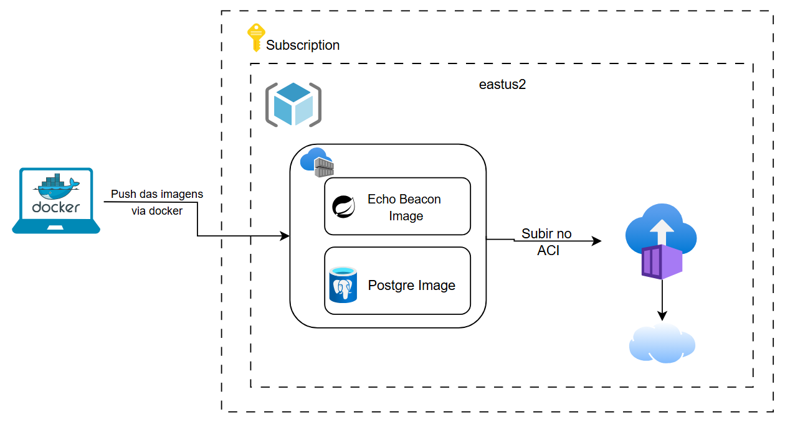

# 🏍️ Echo Beacon MVC - DEVOPS

O projeto **Echo Beacon** foi desenvolvido para a empresa **Mottu** com o objetivo de implementar uma solução tecnológica que melhore a organização e localização das motos no pátio da empresa. A solução integra hardware, software e banco de dados para facilitar a gestão e identificação de veículos de forma eficiente.

Oi professor

---

# 👔 Integrantes
* **Gustavo Lopes Santos da Silva** - RM: 556859
* **Renato de Freitas David Campiteli** - RM: 555627
* **Gabriel Santos Jablonski** - RM: 555452

## 🛠️ Descrição do Projeto

O projeto em desenvolvimento para a empresa **Mottu** visa implementar uma solução tecnológica para melhorar a organização e a localização das motos no pátio da empresa, facilitando a gestão e a identificação de cada veículo de forma mais eficiente. O sistema será composto por uma série de componentes integrados, incluindo **Arduino**, um **aplicativo móvel** e um **banco de dados centralizado**.

A solução será composta por pequenas placas eletrônicas, chamadas de **"EchoBeacon"**, que serão instaladas em cada moto. Essas placas conterão:
- Um **sistema de som** (buzzer).
- Um **LED** para sinalização visual.

Quando uma moto chega ao pátio, informações como **placa**, **chassi** e detalhes sobre qualquer problema específico do veículo serão registradas em um banco de dados integrado. Esses dados poderão ser acessados por um sistema desenvolvido em **Java**.

Além disso, os funcionários responsáveis pela organização e monitoramento das motos no pátio terão acesso a um **aplicativo móvel**, que estará conectado ao banco de dados. Através desse aplicativo, eles poderão:
- Consultar informações detalhadas sobre as motos, como **placa**, **chassi** e **problemas**.
- Ativar o **buzzer** e/ou o **LED** da moto selecionada, emitindo um som e sinal visual para facilitar sua localização, mesmo em um ambiente com várias motos.

Essa solução visa resolver o problema de localizar rapidamente as motos no pátio. Sem uma identificação clara e imediata, os funcionários enfrentam dificuldades para encontrar a moto correta entre tantas outras. Com a implementação desse sistema, a **Mottu** poderá organizar melhor suas motos e otimizar o tempo gasto na identificação e localização dos veículos dentro do pátio, garantindo uma gestão mais ágil e eficiente.

---

## 🎯 Objetivos

- **Facilitar a localização de motos no pátio da empresa.**
- **Otimizar o tempo dos funcionários na identificação de veículos.**
- **Garantir uma gestão mais eficiente e organizada.**

---

## Diagrama de fluxo da aplicação



## 📽️ Link para o vídeo da explicação

- [Vídeo explicativo](https://youtu.be/8kSp6ySZqR0)

## 🚀 Tecnologias Utilizadas

- **Backend**: Java 21 com Spring Boot 3.5.5
- **Framework Web**: Spring MVC com Thymeleaf
- **Banco de Dados**: PostgreSQL com Flyway para migrations
- **Autenticação**: OAuth2 com Google
- **Containerização**: Docker
- **Cloud**: Microsoft Azure (ACR + ACI)
- **Build Tool**: Gradle
- **Testes**: JUnit 5

## 📋 Pré-requisitos

Antes de começar, certifique-se de ter as seguintes ferramentas instaladas:

- **Java 21** ou superior
- **Docker** e **Docker Compose**
- **Azure CLI** (para deploy na nuvem)
- **Git** (para controle de versão)
- **Gradle** (ou use o wrapper incluído no projeto)

---

## 🛠️ Instalação e Configuração Local

### Clone o Repositório
```bash
git clone https://github.com/fiap-2tds-dtcc-fev25/2tdsa-cs-3-echo-beacon.git
cd 2tdsa-cs-3-echo-beacon
```

---

## 🌐 Deploy na Azure

### Pré-requisitos para Deploy
1. **Azure CLI** instalado e configurado
2. **Docker** instalado
3. **Credenciais Google OAuth2** configuradas
4. **Subscription** do Azure ativa

### 1. Configurar Variáveis de Deploy
Edite o arquivo `scripts/deploy.sh` de acordo com que te mandei no **privado do teams** e configure:
```bash
# Substitua pelos seus valores
GOOGLE_CLIENT_ID=seu_google_client_id_aqui
GOOGLE_CLIENT_SECRET=seu_google_client_secret_aqui
ADMIN_EMAIL=seu_email@gmail.com
```

### 2. Build e Push da Imagem Docker

#### Usar Script Automatizado (Recomendado)
```bash
# Dar permissão de execução (Linux/Mac)
chmod +x scripts/build.sh
chmod +x scripts/deploy.sh

# Executar build
./scripts/build.sh
```

### 3. Deploy da Aplicação
```bash
# Executar deploy completo
./scripts/deploy.sh
```

### 4. Verificar Deploy
```bash
# Listar containers
az container list --resource-group rg-cp4-rm556859 --output table

# Ver logs da aplicação
az container logs --resource-group rg-cp4-rm556859 --name aci-app-cp4-rm556859

# Ver logs do banco
az container logs --resource-group rg-cp4-rm556859 --name aci-db-cp4-rm556859
```

### 5. Acessar Aplicação Deployada
- **URL**: `http://aci-app-cp4-rm556859.eastus.azurecontainer.io:8080`

## 🧪 Como Testar a Aplicação

### 1. **Login e Autenticação**
1. Acesse `http://localhost:8080`
2. Clique em **"Login"**
3. Será redirecionado para o Google OAuth2
4. Faça login com sua conta Google
5. Após login bem-sucedido, será redirecionado para a página inicial

### 2. **Testando como Usuário COMUM (USER)**

#### ✅ **Funcionalidades Disponíveis:**
- **Visualizar motos** - Listar todas as motos cadastradas
- **Cadastrar nova moto** - Adicionar moto ao sistema
- **Cadastrar EchoBeacon** - Adicionar dispositivo EchoBeacon
- **Vincular EchoBeacon à moto** - Associar dispositivo a uma moto

#### ❌ **Funcionalidades BLOQUEADAS:**
- **Editar moto** - Botão não aparece
- **Excluir moto** - Botão não aparece
- **Editar EchoBeacon** - Acesso negado

### 3. **Testando como Usuário ADMIN**

#### ✅ **Funcionalidades Adicionais:**
- **Editar moto** - Modificar dados de motos existentes
- **Excluir moto** - Remover motos do sistema
- **Gerenciar EchoBeacons** - Controle total sobre dispositivos

### 4. **Validações e Casos de Erro**

#### 🚫 **Teste de Validações:**
```bash
1. Tente cadastrar moto com placa inválida (ex: "123")
2. Tente cadastrar moto com chassi muito curto
3. Deixe campos obrigatórios em branco
4. Tente cadastrar moto com placa já existente
5. Verifique as mensagens de erro exibidas
```

#### 🔒 **Teste de Segurança:**
```bash
1. Como usuário comum, tente acessar diretamente:
   - http://localhost:8080/motos/editar/1
   - http://localhost:8080/motos/excluir/1
2. Deve ser redirecionado ou receber erro 403 (Forbidden)
```

---

## 🗑️ Limpeza de Recursos

### Remover Recursos da Azure
```bash
# Usar script de limpeza
chmod +x scripts/deleterg.sh
./scripts/deleterg.sh

# Ou manualmente
az group delete --name rg-cp4-rm556859 --yes --no-wait
```

---

## 🧩 Pipelines CI/CD (Azure DevOps)

Este repositório contém um pipeline YAML em `azure-pipelines.yml` que implementa:

- CI: build + testes automáticos (Gradle), publicação do artefato (JAR) e push da imagem Docker para o ACR.
- CD: deploy automático no Azure Container Instances (ACI) após a geração do artefato.

### 1) Pré-requisitos no Azure DevOps

Crie/garanta os seguintes itens:

- Service Connection (Docker Registry) apontando para seu ACR
   - Nome sugerido: `acr-service-connection`
- Service Connection (Azure Resource Manager) com acesso à subscription
   - Nome sugerido: `azure-subscription-connection`
- Variable Group na Library chamado `echobeacon-secrets` com as variáveis (marcar as sensíveis como secret):
   - `GOOGLE_CLIENT_ID` (secret)
   - `GOOGLE_CLIENT_SECRET` (secret)
   - `ADMIN_EMAILS`
   - `DB_NAME` (ex: `echobeacon`)
   - `DB_USER` (secret)
   - `DB_PASSWORD` (secret)

Opcional: ajuste variáveis não secretas via UI (por exemplo `RM`, `AZURE_LOCATION`, `ACR_NAME`).

### 2) Conectar o Pipeline ao GitHub

- Pipelines > New pipeline > GitHub > selecione este repositório.
- Use o arquivo YAML existente `azure-pipelines.yml`.

### 3) Disparo e Fluxo

- CI dispara a cada push em `master` (e também `main`).
- Passos do CI:
   - `./gradlew clean test build` (publica resultados de testes)
   - Publica o JAR como artefato (Azure DevOps)
   - Build e push da imagem para `$(ACR_NAME).azurecr.io/$(IMAGE_NAME):$(Build.BuildId)` e também `:latest`
- CD (Deploy_ACI) executa em seguida:
   - Garante Resource Group
   - (Se necessário) espelha `postgres:17-alpine` para o ACR
   - Cria/atualiza container do Postgres no ACI
   - Cria/atualiza container da aplicação no ACI usando a imagem do CI

### 4) Variáveis importantes no YAML

- `RM` (padrão `556859`) define sufixos de RG/ACI/ACR
- `ACR_NAME` = `acrechobeaconrm$(RM)`
- `RESOURCE_GROUP` = `rg-echobeacon-rm$(RM)`
- `AZURE_LOCATION` = `eastus`

Você pode sobrescrever via UI do pipeline ou diretamente no YAML.

### 5) Observações de Segurança

- Não commitar credenciais. Use o Variable Group (secrets).
- Considere remover valores sensíveis de `scripts/deploy.sh` e usar apenas secrets do Azure DevOps.

---

##  Estrutura do Banco de Dados

- O banco de dados PostgreSQL está hospedado na Azure Container Instance (ACI) e pode ser acessado com as seguintes credenciais:
```
psql -h aci-db-echobeacon-rm556859.eastus.azurecontainer.io  -p 5432 -U echobeacon -d echobeacon
```
O projeto utiliza **Flyway** para gerenciar as migrations do banco de dados:

### Migrations Incluídas:
1. **V1__create_echo_beacon.sql** - Tabela de dispositivos EchoBeacon
2. **V2__create_moto.sql** - Tabela de motos
3. **V3__create_echobeacon_user.sql** - Tabela de usuários
4. **V4__insert_initial_echo_beacon.sql** - Dados iniciais de EchoBeacons
5. **V5__insert_initial_moto.sql** - Dados iniciais de motos


## 🛡️ Segurança

### Configurações de Segurança Implementadas:
- **OAuth2** com Google para autenticação
- **ADMIN_EMAILS** para controle de acesso administrativo
- **HTTPS** recomendado para produção
- **Variáveis de ambiente** para credenciais sensíveis

### Boas Práticas:
1. Nunca commitar credenciais nos arquivos de código
2. Usar variáveis de ambiente para configurações sensíveis
3. Configurar HTTPS em produção
4. Manter as dependências atualizadas

---